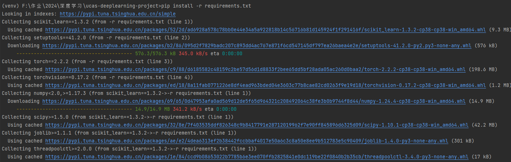
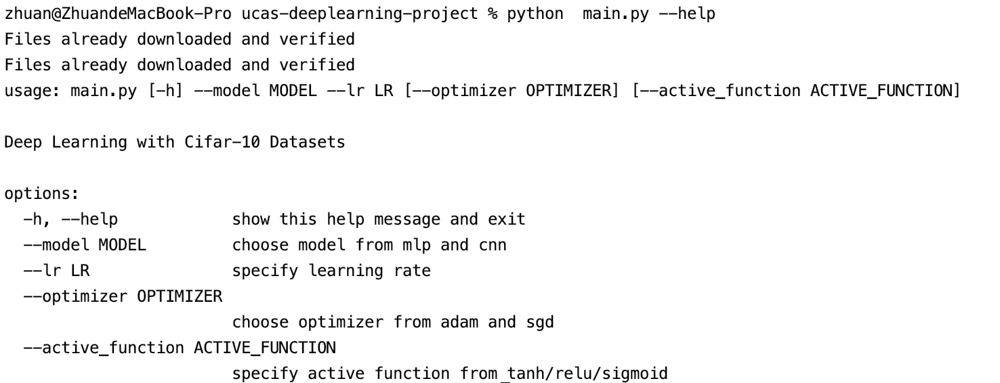

Train Cifar10 with Pytorch
========================

# Setup

1. python: 3.8+
2. Pytorch: 2.2.1+

```
pip install -r requirements.txt
```



# Training

## help
```
python main.py  --help
```



## train
```
python main.py --model mlp --optimizer sgd --lr 0.001 --active_function relu
```

## modify default value
Please update config.ini to modify default value.

# Accuracy
| Model | Best Accuracy | Time(s) |
| -- | -- |--|
| MLP | 0.54 |869|
| CNN | 0.70|404|
| ResNet18 | 0.88|3306|
| ResNet34|0.90|2238|